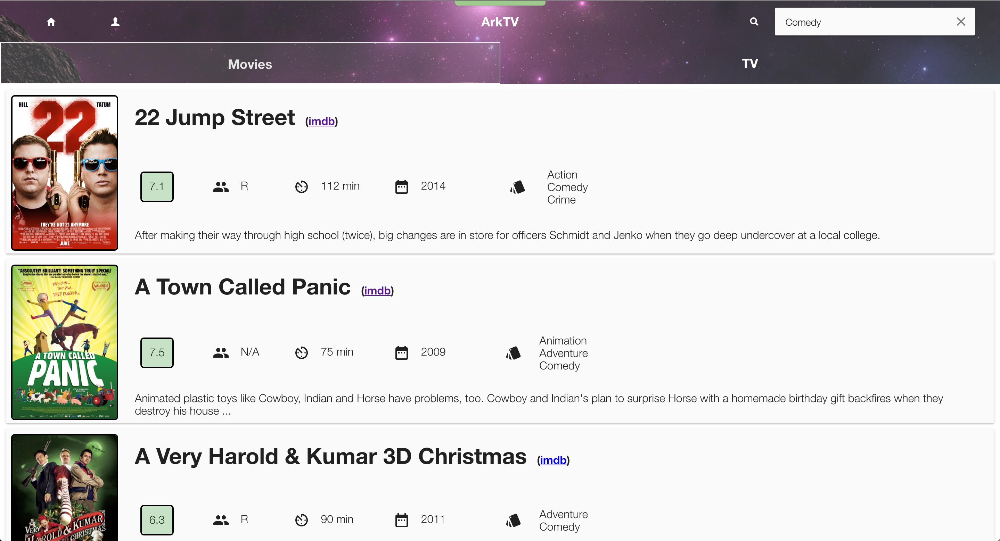
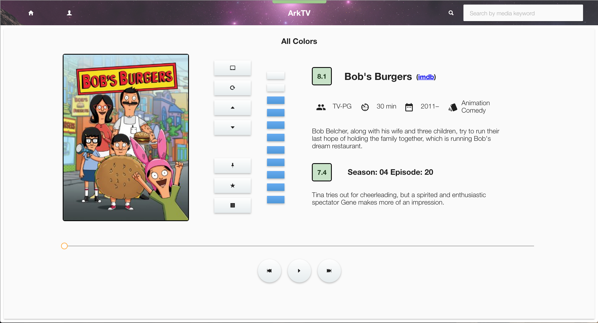
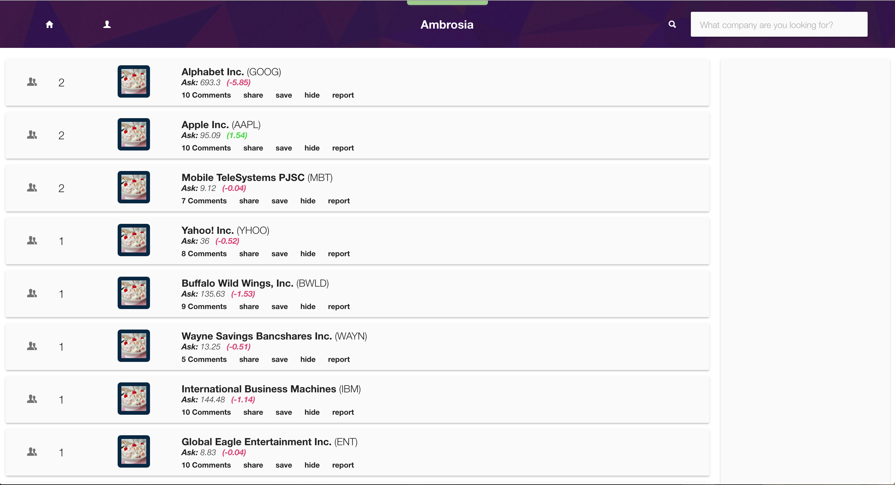
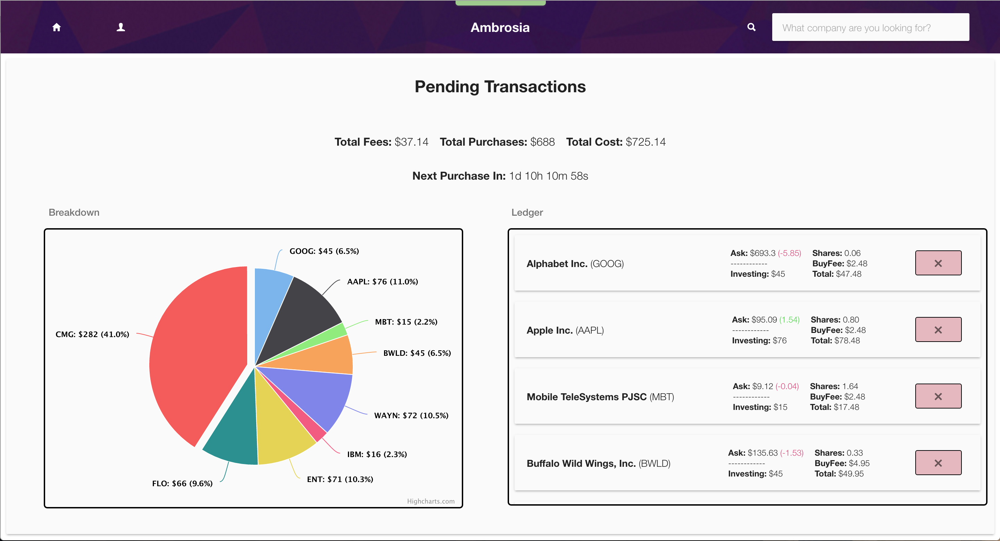
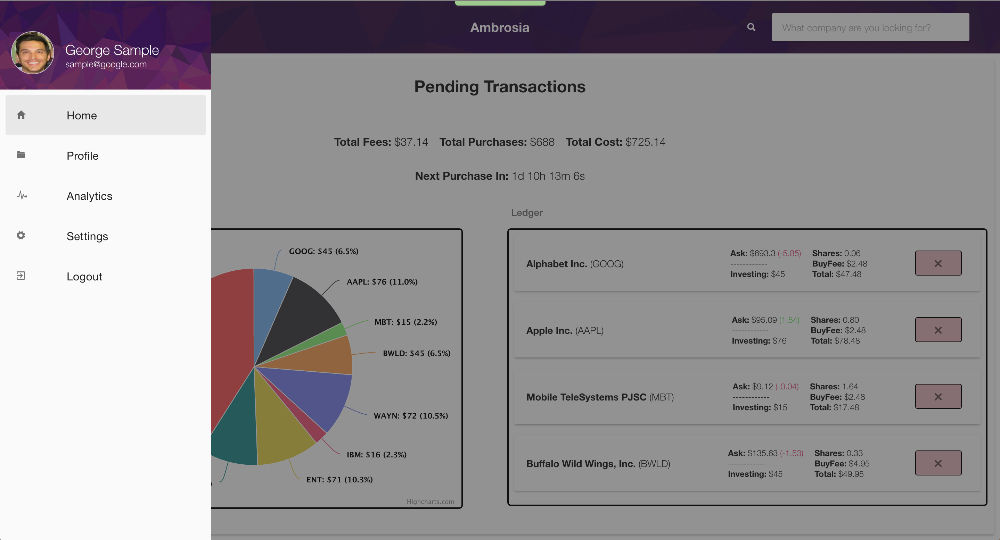
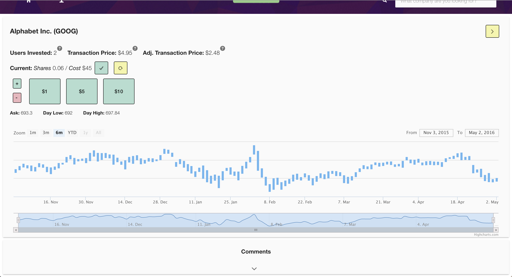
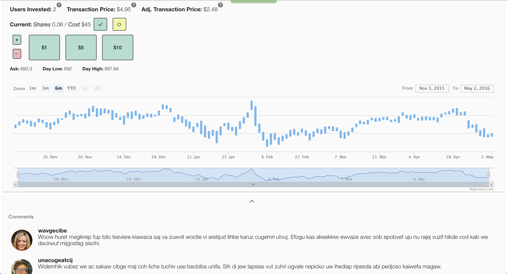

## Ambrosia

### Frameworks / Libraries
⋅⋅⋅NodeJS
⋅⋅⋅Angular
⋅⋅⋅LESS
⋅⋅⋅Gulp
⋅⋅⋅Material Design
⋅⋅⋅S3

### Description

A malleable framework allowing a user to quickly create their own website with a complete content management system. The site includes a login and user settings page along with functional S3 integration for users to upload profile information and files to the website's server. Check out screens of just a few instances of this framework being used in production!

### Install

1. `npm install`

2. `bower install`

3. `npm start`

4. navigate to localhost:3000 in your browser

### DotDash Screens

### HopShares Screens

#### license

MIT. Copyright (c) Brad Zimmerman
