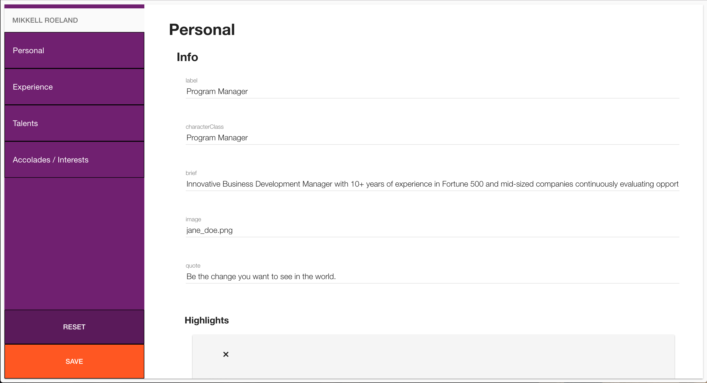
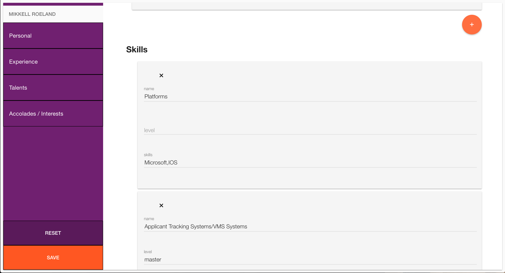

## CareerMuse Client

### Frameworks / Libraries
* NodeJS
* Angular
* LESS
* Gulp
* Material Design

### Description

A quick client CMS for Careermuse's resume builder site.

### Install

1. `npm install`

2. `npm start`

3. navigate to localhost:3000 in your browser

### Demo

[Demo](https://shielded-citadel-61095.herokuapp.com/)

### Client Screens

#### license

MIT. Copyright (c) Brad Zimmerman
